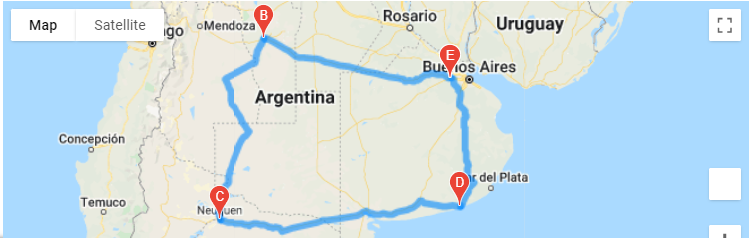

# World_Weather_Analysis

## Table of Contents
- [Overview of Project](#OverviewProject)
- [Results](#Results)
- [Summary](#Summary)
- [Resources](#Resources)

## Overview of Project
In thi project we generated a randomn list of cities and then did an API call to the World Wide Weather to collect the current weather data from those cities. We then picked a temperature range for which we wanted the temperature to stay in. We used google places to find hotel information for those cities. Then we created markers with the hotel information and weather data and plotted them in google maps. Finally we picked 4 cities and we created an itenerary, using google directions. 

## Results

  

 Figure 1: Cities with Weather between 70 and 96F and markers 
 

  

 Figure 2: Itenerary between 4 cities 
 

  

 Figure 3: Itenerary between 4 cities and markers 
 

##  Summary

## Resources
